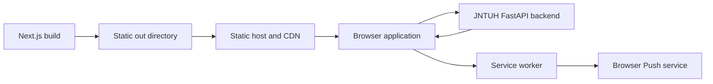
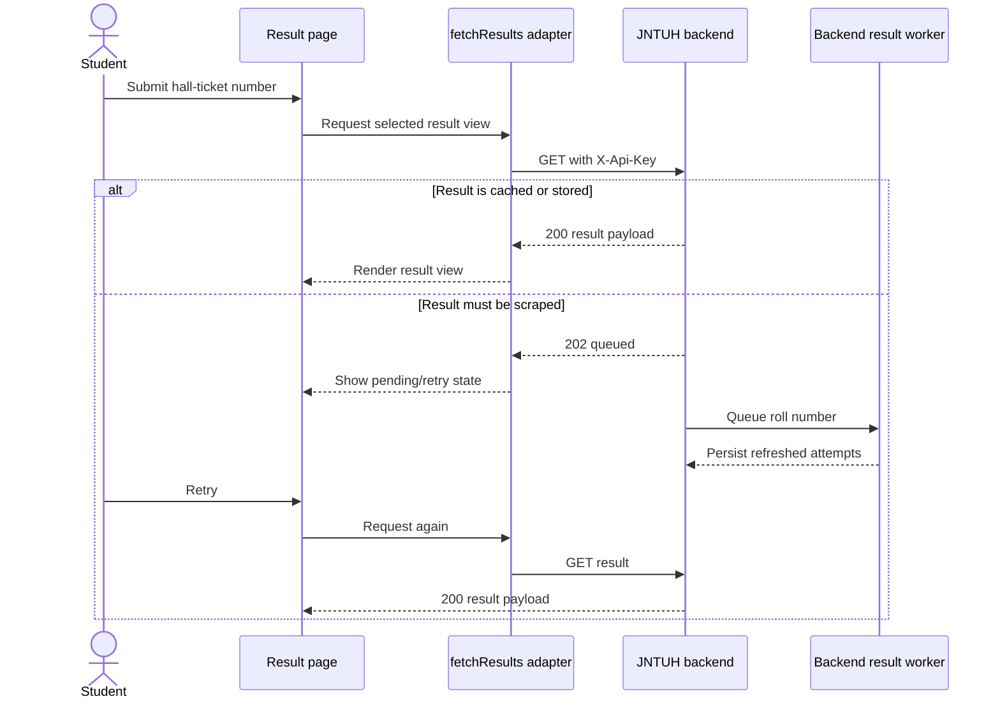

# JNTUH Connect Web Architecture

## Purpose

This repository is the browser client for the JNTUH Connect platform. It renders result-oriented tools and supporting academic content while delegating authoritative data, scraping, persistence, notification registration, and admin mutations to the backend.

## Runtime model

The application is a static Next.js export:

`next.config.js` configures `output: "export"` and unoptimized images. Every route must be buildable without a server-side request dependency. The hosting platform serves HTML, JavaScript, CSS, images, the web manifest, `sw.js`, `llms.txt`, and social assets from `out/`.

## Source organization

- `app/`: App Router pages, route layouts, sitemap, robots, metadata, and global styling.
- `components/api/`: browser-side backend adapters for results and notifications.
- `components/result/` and `components/results/`: result projection/rendering components.
- `components/journey/` and `components/wrapped/`: derived student storytelling/statistics.
- `components/notifications/`: notification filters, lists, and detail navigation.
- `components/carrers/`: job board UI (directory name is legacy; public route is `/careers`).
- `components/ui/`: shared UI primitives.
- `customhooks/`: navigation/sidebar state, install prompts, and browser push setup.
- `lib/apiClient.ts`: backend base URL, public API header, and Axios interceptor.
- `lib/jobs.ts`: typed jobs endpoint adapter.
- `constants/`: static labels, mappings, resource lists, and navigation content.
- `public/`: PWA assets, service worker, icons, social images, and public metadata.

## Result read flow

The browser does not scrape JNTUH or persist authoritative result records. It submits a validated roll number and interprets the backend's cached/stored/pending/error contract.

## Backend integration

`NEXT_PUBLIC_URL` is the base used by result, notification, calendar, syllabus, jobs, grace-marks, and subscription requests. Keep the trailing slash so URL concatenation remains correct.

`lib/apiClient.ts` registers a global Axios request interceptor. It attaches `NEXT_PUBLIC_API_KEY` only when the resolved Axios URL begins with the configured backend base. Modules making raw `fetch()` calls, such as browser push setup, must add the same header explicitly.

The gateway value is public because it is embedded in client JavaScript. Privileged backend routes must also require server-held admin authorization; hiding an admin page or using a `NEXT_PUBLIC_*` value is not an authorization boundary.

## UI and state

Most interactive pages are client components. Query strings carry hall-ticket numbers between search and result routes. Result payloads are held in component state; limited convenience state may use browser `localStorage`. Theme, sidebar, and navbar state are provided through React contexts.

Derived experiences such as Journey and Wrapped combine academic and all-attempt responses in the browser. When backend response models change, update TypeScript types, adapters, derived-stat calculations, empty/pending states, and rendered views together.

## Browser push

`customhooks/setupPush.ts`:

1. Creates or reuses a random anonymous browser identifier in `localStorage`.
2. Registers `/sw.js`.
3. Subscribes through `PushManager` using `NEXT_PUBLIC_VAPID_PUBLIC_KEY`.
4. Posts the subscription and optional roll number to the backend.

Push requires HTTPS in production (localhost is allowed for development), a matching backend VAPID configuration, and compatible browser permission.

## Static build constraints

- Do not add runtime Next.js API routes, middleware, server actions, or request-time secrets while `output: "export"` is enabled.
- Dynamic routes must be statically enumerable or implemented through client-side query parameters.
- Environment values are fixed at build time. Changing a public backend URL/key requires rebuilding and redeploying the static artifact.
- `vercel.json` contains cache headers for Vercel-compatible deployments; another host needs equivalent cache policy in its own configuration.
- Long-lived caching is appropriate for hashed `_next/static` assets, not mutable HTML or service-worker files.

## External boundaries

- FastAPI backend: results, notifications, content, jobs, proofs, subscriptions.
- Browser Push service: web notifications.
- Google Analytics: optional measurement when configured — also carries this app's telemetry events (see below), since there is no separate error-tracking/APM vendor.
- External document/community/job links: opened from client navigation.
- Static host/CDN: delivery, TLS, redirects, and cache behavior.

## Observability

No dedicated error-tracking service (no Sentry/etc.) — the static-export constraint (no server) and a deliberate choice to avoid adding self-hosted infrastructure ruled that out. Instead:

- `lib/telemetry/logger.ts` wraps `console.*`; `warn`/`error` also fire a GA `client_error` event `{scope, message}` so error frequency is visible in aggregate. All call sites elsewhere use this instead of raw `console.*`.
- `lib/telemetry/scrub.ts` redacts roll-number-shaped 10-character tokens and denylisted keys before anything is logged or tracked — enforced centrally so individual call sites can't leak student data by omission.
- `lib/apiClient.ts`'s Axios response interceptor derives a `routeLabel` from the backend URL's *path* only (never the query string, where `rollNumber` lives) against a small allowlist, and fires a GA `api_failure` event on network errors and backend 5xx/429 responses. Expected states (`202` pending, `404`/`409`/etc.) are unaffected — those adapters already handle them via `validateStatus: () => true` and their own toast messaging.
- `app/error.tsx` / `app/global-error.tsx` are route/root error boundaries — previously a render error showed nothing meaningful to the user.
- `components/analytics/WebVitals.tsx` forwards Core Web Vitals to GA as a `web_vitals` event.
- `customhooks/setupPush.ts` fires `push_subscription_success`/`push_subscription_failure` GA events.

`components/api/fetchAcademicResult.tsx`, `fetchNotifications.tsx`, and `fetchClassResult.tsx` are pre-static-export legacy code (hardcoded external URLs, a `/api/redisdata` route that can't exist under `output: "export"`) — dead except for one `getLocalStoragedata` helper re-exported from `fetchAcademicResult.tsx`. The live adapters are all in `components/api/fetchResults.tsx`. Do not extend the dead files; if removing them, first confirm no re-export is still referenced.

## Architectural invariants

- The backend remains authoritative for results and admin mutations.
- All browser-visible environment configuration is public.
- Every production route must survive a static export build.
- No academic payload or identifier reaches logs or analytics — enforced by `lib/telemetry/scrub.ts` and the path-only `routeLabel` derivation in `lib/apiClient.ts`.
- Pending `202` is a normal result state, not a generic failure.
- API model changes require coordinated updates across adapters, types, and derived views.
- Admin authorization must be enforced by the backend.
- Do not log or persist more student data than the UI requires.
